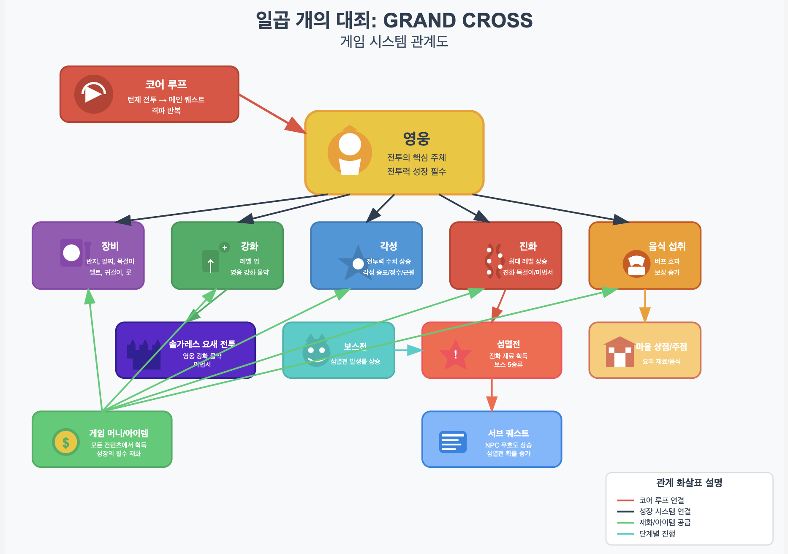

# 핵심 게임 시스템 구조

 

### 1. 코어 루프
- **핵심 사이클**: 턴제 전투 → 메인 퀘스트 클리어 → 다음 퀘스트 진행
- **구조**: 챕터 단위 진행 (각 챕터당 3~10개 메인 퀘스트)
- **진행 방식**: 스토리 진행에 따라 요구되는 전투력이 지속적으로 상승
여기서 영웅은 모든 전투의 핵심 주체로, 지속적인 성장이 필수적입니다.
   

### 2. 전투력 성장 시스템
#### 1) 장비 시스템
- **효과**: 장착만으로 즉시 전투력 상승
- **종류**: 반지, 팔찌, 목걸이, 벨트, 귀걸이, 룬
- **획득처**: 게임 내 다양한 컨텐츠 보상

#### 2) 강화 시스템
- **효과**: 영웅 레벨 상승
- **필요 재료**: 영웅 강화 물약, 게임 머니
- **특별 컨텐츠**: 솔가레스 요새 전투 (영웅 강화 물약 전용 획득처)

#### 3) 각성 시스템
- **효과**: 기본 전투력 수치 상승
- **필요 재료**: 풀 각성 증표, 각성의 정수, 각성의 근원
- **특징**: 레벨과 별개로 작동하는 고정 스탯 상승

#### 4) 진화 시스템
- **효과**: 최대 레벨 한계 상승
- **필요 재료**: 
  - 진화의 목걸이
  - 마법서 (솔가레스 요새 전투에서 획득)
  - 보스 재료: 마수 하우렉스의 귀, 회색 마신의 날개, 붉은 마신의 뿔
- **연계 시스템**: 섬멸전

#### 5) 음식 섭취 시스템
- **효과**: 
  - 전투 중 일시적 버프 (전투력 보완)
  - 보상 증가 효과
- **제한**: 전투당 1개 음식만 사용 가능
- **특징**: 캐릭터별로 효과가 있는 음식이 정해져 있음
- **획득처**: 
  - 마을 상점 (요리 재료)
  - 주점 (요리 제작 또는 완성품 구매)
   

### 3. 관련 컨텐츠 시스템
#### 1) 보스전 → 섬멸전 시스템
- **보스전**: 
  - 섬멸전 발생 확률을 상승시키는 전투
  - 누적 확률이 100%에 도달하면 섬멸전 발생
- **섬멸전**: 
  - 5종류의 보스가 등장하는 대규모 전투
  - 각 보스는 고정된 출몰 장소 존재
  - 진화 재료 획득의 주요 경로
- **우호도 시스템**: 
  - 섬멸전 발생 장소의 NPC 서브 퀘스트 완료로 우호도 상승
  - 높은 우호도 = 해당 지역 섬멸전 발생 확률 증가
  - 보스전 횟수를 줄여 효율적인 진행 가능

#### 2) 재화 시스템
- **게임 머니**: 모든 성장 시스템의 기본 재화
- **아이템/재료**: 각 성장 시스템별 고유 재료
- **획득처**: 게임 내 모든 컨텐츠에서 다양하게 획득 가능
   

이와 같은 시스템이 연결되어 《일곱 개의 대죄: GRAND CROSS》의 게임플레이 경험을 구성합니다.
     